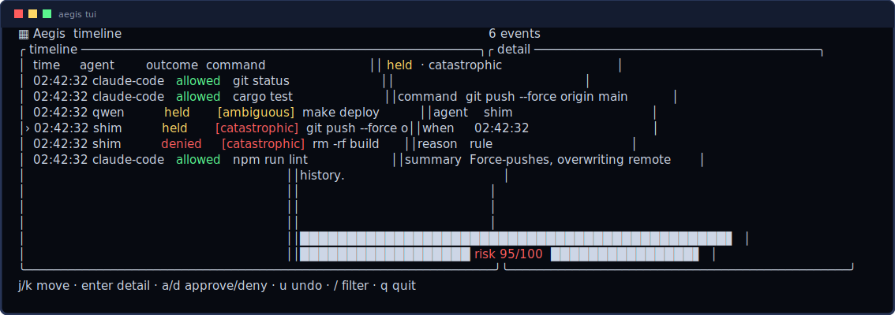
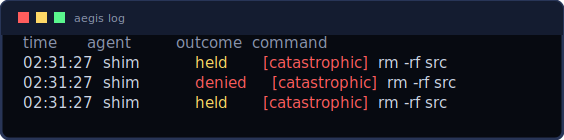

# Aegis

**Website:** https://arrowassassin.github.io/aegis/ (8-bit product site with live
feature frames — deploys from [`site/`](site/) once GitHub Pages is enabled with
source "GitHub Actions").

A local-first safety layer for AI coding agents. Aegis intercepts the commands an
agent is about to run, warns you in plain English **before** they execute, makes
destructive actions reversible, and keeps a tamper-evident record of everything
every agent did on your machine. No kernel code, no OS-vendor approvals, no code
leaves your machine.


> **Security spine:** rules block, the model only explains. The decision to
> hold/deny a catastrophic command is made by deterministic rules, never by an
> LLM. The raw command is always shown verbatim. The event log is append-only and
> hash-chained. See [`CLAUDE.md`](CLAUDE.md) for the full, non-negotiable rules.

### See it

The live TUI — bordered timeline + detail panels, a risk gauge (all real output):



The cross-agent timeline and the approval queue:




## Status

All build phases are implemented (see
[`aegis-phase0-1-tasklist.md`](aegis-phase0-1-tasklist.md) and
[`aegis-phase2-5-designdoc.md`](aegis-phase2-5-designdoc.md)):

- **Phase 0 — Recorder:** agent-agnostic interception (`$PATH` shim + Claude Code
  hook + `aegis-exec` MCP server) recording every command to a tamper-evident,
  hash-chained SQLite log.
- **Phase 1 — Gate:** a deterministic rule engine that holds dangerous commands
  for one-key approval, with per-repo decision memory and `.aegis.toml` policy.
- **Phase 2 — Explain + score:** a warm Tier-2 scorer fills a plain-English
  summary and a risk score for the ambiguous band, driving graduated unattended
  mode (heuristic by default; real CPU GGUF inference behind `--features llama`).
- **Phase 3 — Undo:** snapshots before destructive ops (reflink CoW + copy
  fallback) and `aegis undo` / `aegis undo --session`.
- **Phase 4 — Recorder UI:** an FS-watcher backstop and a live `ratatui` timeline
  (`aegis tui`).
- **Phase 5 — Launch:** the panic kill-switch (`aegis panic` / `aegis resume`),
  `aegis init` polish, and a cross-platform release workflow.

## Crates

| crate | role |
|-------|------|
| `aegis-core` | shared types, rule engine, policy, decision memory, hash-chained event log |
| `aegis-daemon` | resident process: local IPC server + decision loop |
| `aegis-intercept` | the `$PATH` shim, Claude Code hook bridge, and `aegis-exec` MCP server |
| `aegis-cli` | the `aegis` binary: `init`, `status`, `log` |
| `aegis-model` | Tier-2 model wrapper (stub until Phase 2) |
| `aegis-tui` | ratatui timeline (Phase 4) |

## Install (no clone needed)

One line — downloads the prebuilt binaries (checksum-verified), or builds from
source if there's no prebuilt build for your platform:

```sh
curl -fsSL https://arrowassassin.github.io/aegis/install.sh | sh
```

Or straight from source with Cargo (no clone):

```sh
cargo install --git https://github.com/arrowassassin/aegis aegis-cli aegis-daemon aegis-intercept
```

Then:

```sh
aegis init        # detect agents, wire interception, start the daemon
aegis status      # daemon / socket / log / kill-switch health
aegis tui         # live, interactive timeline (j/k, enter, a/d, u, /, q)
```

Other commands: `aegis log`, `aegis undo [--session]`, `aegis queue` /
`approve <id>` / `deny <id>`, `aegis watch <path>`, `aegis panic` / `resume`.
The Tier-2 model, snapshots/undo, the TUI, the FS backstop, and the kill-switch
are documented in [`docs/`](docs/) (`model.md`, `policy.md`, `mcp.md`, `queue.md`,
`demo.md`).

## Claude Code plugin

This repo doubles as a Claude Code plugin marketplace. Install the binaries (see
above), then enable the plugin (which wires the hook + MCP server):

```sh
/plugin marketplace add arrowassassin/aegis
/plugin install aegis@aegis
```

The plugin is a thin wiring layer (`plugin/aegis/`); install the native binaries
with the one-liner above (they're not bundled). See
[`plugin/aegis/README.md`](plugin/aegis/README.md).

`aegis init` prints a `PATH` line to prepend so the shim can guard raw
shell-outs. Pointing tool-calling agents at the MCP server is documented in
[`docs/mcp.md`](docs/mcp.md); per-repo policy in [`docs/policy.md`](docs/policy.md).

## Demo

See [`docs/demo.md`](docs/demo.md). The 30-second flow — an agent's `rm -rf` is
held *before* it runs, you deny it, and it lands on the tamper-evident timeline:

```sh
bash scripts/demo.sh            # interactive (press a/d/r at the hold card)
DEMO_KEY=d bash scripts/demo.sh # non-interactive
```

## Building & testing

```sh
cargo test            # unit + integration tests
cargo clippy --all-targets -- -D warnings
cargo fmt --check
```

## License

MIT — see [`LICENSE`](LICENSE).
