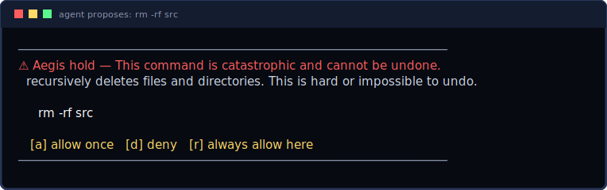

# The Tier-2 model (Phase 2)



Kintsugi's decision to **block** a catastrophic command is always deterministic
rules. The model never makes that call. Its only jobs are to **explain** (a
one-sentence summary for the hold card) and to **score** the *ambiguous band*
(a `risk` 0–100) for the human reviewing the queue. Its influence is
escalation-only: it can add caution, never unlock or downgrade a rule-based
decision, and `Safe` commands stay on a model-free fast path.

## Backends

| backend | when | needs |
|---------|------|-------|
| `HeuristicScorer` | **default** | nothing — deterministic, offline, always available |
| `LlamaScorer` | `--features llama` | a C/C++ toolchain to build `llama.cpp` |

The heuristic backend is also the graceful-degradation path: if the real model
can't load, Kintsugi keeps working with rules + heuristic scoring.

> **The installer does NOT download a model.** `curl … | sh` and `cargo install`
> ship the default (heuristic) build — small, offline, no weights. The GGUF model
> is strictly opt-in (below).

## Managing the model: `kintsugi model`

One command manages the whole model lifecycle. The chosen GGUF is persisted to a
small file in the data dir (`model.path`), so the daemon loads it across restarts
**without** depending on a shell env var — and `kintsugi model use`/`pick`/`remove`
restart a running daemon so the change takes effect immediately.

| command | what it does |
|---------|--------------|
| `kintsugi model status`  | what's configured, whether this daemon has the inference engine, and what it's scoring with right now — so a "model set but still heuristic" mismatch is diagnosable in one place |
| `kintsugi model use <path>` | point the daemon at any local GGUF and reload — swap models anytime, no Kintsugi update, no recompile |
| `kintsugi model pick`    | download/choose a GGUF from Hugging Face (the picker), then load it |
| `kintsugi model install` | build the in-process llama engine (needs a C/C++ toolchain) **and** download a model — the one-step path for `cargo install` users |
| `kintsugi model remove`  | forget the model; fall back to the always-on heuristic scorer |

`kintsugi model status` is the first thing to run when a downloaded model "isn't
working": the most common cause is a daemon built **without** the inference engine
(a plain `cargo install`), which can't load any GGUF until you run
`kintsugi model install`. Precedence when the daemon loads: `KINTSUGI_MODEL_FILE`
(env) first, then the persisted `kintsugi model use` selection, then the pinned
default.

## Model

| tier | model | size (Q4_K_M) | when |
|------|-------|---------------|------|
| primary  | **Qwen3-4B-Instruct**   | ~2.5 GB | RAM ≥ ~6 GB |
| low-RAM  | **Qwen3-1.7B-Instruct** | ~1.1 GB | otherwise (auto-selected) |

Our Tier-2 job is tiny — emit forced-short JSON (`{summary, risk}`) — so it
favours a *small, permissive, instruction-tuned* model with reliable structured
output over raw size. We surveyed the current small-model field (Qwen3.x,
Llama 3.2, Gemma, Phi-4-mini) and default to the Qwen3 instruct family:
Apache-2.0 (no usage restrictions for a tool we ship to others), first-party
GGUF builds at the sizes we want, and best-in-class small-model
instruction-following. The 1.7B fallback is same-family so RAM-based selection
behaves identically at the low end.

### Future-proof: bring your own model (`KINTSUGI_MODEL_FILE`)

Models move fast, so the durable answer isn't the pinned constant. Point Kintsugi at
**any** local GGUF and it loads that one — no recompile, no pinned spec:

```sh
export KINTSUGI_MODEL_FILE="/path/to/your-model.gguf"
```

This is a deliberate bring-your-own-weights trust path (you chose the file), so
it bypasses the checksum pin — which only guards the daemon's own `download`
fetch. `KINTSUGI_MODEL_DIR` still overrides where pinned weights are cached.

### Pick a model interactively

Don't have a GGUF yet? The picker fetches a short, RAM-appropriate list of small
instruct GGUF models from the Hugging Face API, downloads your choice, prints its
SHA-256, and tells you the one env var to set:

```sh
curl -fsSL https://kintsugi.tools/pick-model.sh | sh
# or during install:
curl -fsSL https://kintsugi.tools/install.sh | sh -s -- --with-model
```

It constrains the query (`filter=gguf`, `pipeline_tag=text-generation`, sized to
your RAM) so only viable options come back, and picks the single-file Q4_K_M
build in the repo. Like `KINTSUGI_MODEL_FILE`, a picked model is your choice and is
not checksum-pinned; the printed SHA-256 lets you record/pin it yourself.

> Research sources (2026-06): Qwen3/Qwen3.x model cards and GGUF repos on
> huggingface.co (`Qwen/Qwen3-4B-Instruct`, `Qwen/Qwen3-1.7B-Instruct`),
> qwen.readthedocs.io, and the Hugging Face models API
> (`huggingface.co/api/models`). Re-run the picker any time the field moves —
> the mechanism stays correct even as specific models age out.

## Running with the real model

```sh
# 1) Pin the weights in crates/kintsugi-model/src/manage.rs (set url + sha256).
# 2) Build with inference + download enabled:
cargo build --release -p kintsugi-daemon --features "kintsugi-model/llama kintsugi-model/download"
# 3) Weights auto-select by RAM (4B if >= ~6 GB, else the 1.7B fallback),
#    download once (checksum-verified), and stay warm in the daemon.
```

Override the weights directory with `KINTSUGI_MODEL_DIR`. Weights are **pinned by
SHA-256**; an unpinned spec is refused rather than loading an unverified blob.

## How it affects decisions

- **Safe** → never scored (fast path).
- **Ambiguous** → `summary` + `risk` filled (`tier = 2`).
  - *Attended:* held; the model explains and shows a risk meter.
  - *Unattended:* **denied and queued** for review — the model records its risk
    for the human looking at the queue but **never** flips the rules' Deny to
    Allow. This is the monotonic-influence guarantee (spine rule #2): the model
    may only *add* caution, never remove it.
- **Catastrophic** → summarized for the hold card, but the decision is unchanged
  (held in attended, denied in unattended) **regardless of the score**.

> **Auto-proceeding unattended** is done with explicit, human-authored rules, not
> the model: pre-allow known-safe commands in `.kintsugi.toml` (`[rules] allow = […]`)
> or with `[r]` decision memory. Those are *your* decisions; the model can't make
> them for you. (Earlier builds had a `risk < threshold → allow` "graduated"
> path; it was removed because it let the model downgrade a rules Deny.)
