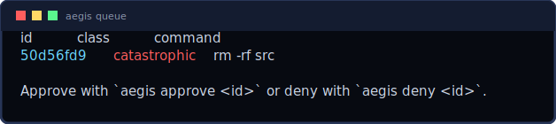

# The approval queue — how a held command proceeds



When Aegis **holds** a command, the agent is never left without an answer. How it
proceeds depends on the path:

| path | on hold | how it proceeds |
|------|---------|------------------------|
| native hook, **ambiguous** | `ask` (or `deny` on CLIs without ask) | the agent's own prompt; approve → it runs → agent continues |
| native hook, **catastrophic** | `deny` (one-shot) | the agent does **not** run it; you run it yourself with `aegis run <id>` (see below) |
| `$PATH` shim (attended) | live hold card | press `a` → real binary runs → shell gets the output |
| MCP `aegis-exec` | enqueued + (optional) wait | a human approves from CLI/TUI → the same call runs the command and returns output |

The **queue** is "holds not yet resolved." Two verbs resolve it, by origin:

- **`aegis approve <id>`** — for an **in-band** origin (the `$PATH` shim or the
  MCP server), a caller is already waiting; approving runs it *there* and returns
  the output to the agent. For a **hook** origin nothing is waiting, so approve
  only records the decision (it won't execute) — it tells you to use `aegis run`.
- **`aegis run <id>`** — for a **hook**-blocked command (one-shot, no waiter):
  **you** run it. Aegis snapshots the predicted paths, runs the exact command in
  its original directory, and records it; `aegis undo` rolls it back. You confirm
  with a code typed at your terminal (`/dev/tty`), so an agent shelling out to
  `aegis run` can't self-approve by pre-stuffing a keypress. Pass no id when a
  single command is held. (Refuses on an in-band origin — use `aegis approve`,
  since its waiting caller would otherwise run it too.)

Both are also reachable from `aegis queue` (lists held ids + the right verb) and
`aegis tui` (`a` / `d` on a held row).

### Exactly-once

Resolving a held command is an atomic compare-and-swap on its queue status, so a
racing double `aegis approve`/`aegis run` can't double-execute or log a phantom
approval — only the first claim proceeds.

### Honest reversibility

`aegis run` snapshots the files a command is *predicted* to touch (parsing
`;`/`&&`/`|` segments and tracking `cd`). For **bounded** targets (a directory,
named files) `aegis undo` fully restores them. For **unbounded** targets — globs,
`$VARS`/expansions, the filesystem root, device nodes — a snapshot can't cover
everything; `aegis run` says so before you confirm and the filesystem-watcher
backstop is the net. The terminal confirmation is a strong speed bump, not a
sandbox: per the honest guarantee, Aegis guards agent *mistakes*, not a malicious
same-user process.

## In-band approval for autonomous agents (MCP)

By default the `aegis-exec` tool returns "held (id …)" immediately so the agent
is never wedged. Set `AEGIS_APPROVAL_TIMEOUT=<seconds>` to make the tool **wait**
for a human decision and then proceed in the same call:

```sh
AEGIS_APPROVAL_TIMEOUT=300 aegis-mcp   # wait up to 5 min for approval
```

Flow: agent calls `aegis-exec` → Aegis holds it and queues it → you run
`aegis approve <id>` (or press `a` in `aegis tui`) → the held command runs and its
output returns to the agent, which continues. On timeout the tool returns
"still pending" (re-run after approving, or pre-authorize).

## Making routine commands flow without nagging

- **`[r]` / memory:** approve once with "always allow here" → that exact command
  auto-allows forever in the repo.
- **`.aegis.toml` policy:** pre-authorize patterns (`allow = ["rm -rf target"]`).
- **Unattended + model:** the Tier-2 model auto-allows the safe-enough ambiguous
  band against `threshold`; only the genuinely dangerous queue.

## Security

A human may approve a queued command of any class — including catastrophic — as a
deliberate override (the same trust as `[r]`). The **model never** approves a
catastrophic command; the kill-switch (`aegis panic`) overrides everything and
denies the entire queue until `aegis resume`.
